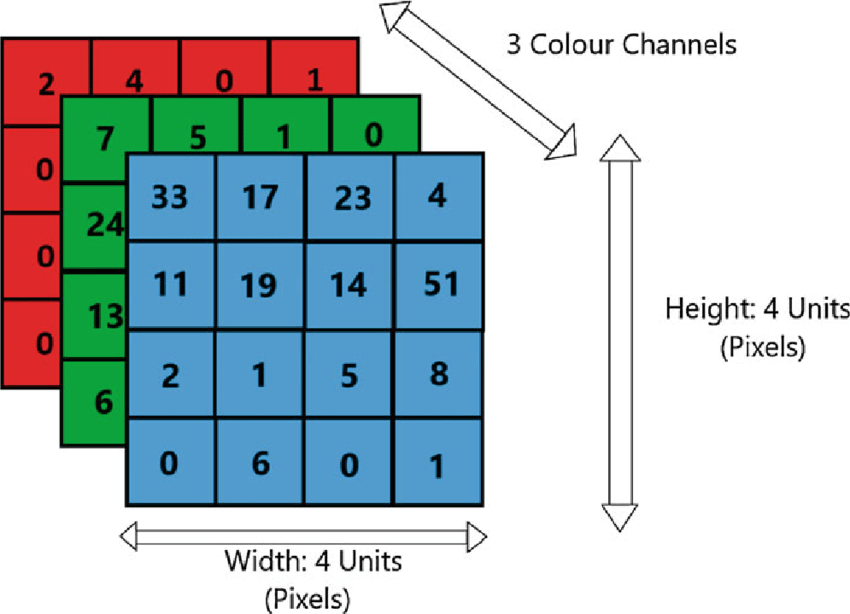

# Tensor
This sections documents our implementation of class Tensor. As of now, our tensor is dedicated to provide optimized performance when working with CNNs (Convolutional Neural Network). Additionally, it has experimental flexible dimensionality for future RCNN and LSTM support. 

## Supported Layouts (Memory Layout)
- NCHW (Batch size, Channels, Height, Width) (Primary support)
- NHWC (Batch size, Height, Width, Channels)
- NCDHW (Batch size, Channels, Depth, Height, Width) 
- More to come...

## Enumerations and Traits

### `Layout` Enum

This enumeration defines the supported memory layouts for the tensors:

* `NCHW`: **N** (Batch), **C** (Channels), **H** (Height), **W** (Width). Common for 4D tensors in frameworks like PyTorch.
* `NHWC`: **N** (Batch), **H** (Height), **W** (Width), **C** (Channels). Common for 4D tensors in frameworks like TensorFlow.
* `NCDHW`: **N** (Batch), **C** (Channels), **D** (Depth), **H** (Height), **W** (Width). Used for 5D tensors in 3D CNNs (e.g., video processing).
* `NDHWC`: **N** (Batch), **D** (Depth), **H** (Height), **W** (Width), **C** (Channels). Used for 5D tensors in 3D CNNs, common in TensorFlow.

### `LayoutTraits` Struct Template

A helper struct that provides the dimensionality (`dims`) associated with each `Layout` enum value. This allows for compile-time determination of the tensor's number of dimensions based on its chosen layout.

---

## Member Functions

### Constructors

The `Tensor` class offers several constructors to initialize tensors in various ways:

* **`Tensor()`**: Default constructor, creates an empty tensor with all dimensions and data size set to zero.
* **`Tensor(size_t batch, size_t channels, size_t height, size_t width)`**:
    Constructs a 4D tensor with the specified dimensions, initialized with zeros. Asserts that the template's `dims` is 4.
* **`Tensor(size_t batch, size_t channels, size_t depth, size_t height, size_t width)`**:
    Constructs a 5D tensor with the specified dimensions, initialized with zeros. Asserts that the template's `dims` is 5.
* **`Tensor(const std::vector<size_t>& shape)`**:
    Constructs a tensor with the dimensions specified by the `shape` vector, initialized with zeros. The `shape` vector's size must match the tensor's dimensionality (`dims`).
* **`Tensor(const std::vector<size_t>& shape, const std::vector<T>& data)`**:
    Constructs a tensor with the specified `shape` and initializes its elements with the provided `data` vector. The total size implied by `shape` must match `data.size()`.

### Copy and Move Operations

* **`Tensor(const Tensor& other)` (Copy Constructor)**:
    Creates a deep copy of an existing `Tensor` object.
* **`Tensor(Tensor&& other) noexcept` (Move Constructor)**:
    Efficiently transfers ownership of resources from `other` to the new tensor, leaving `other` in a valid but empty state.
* **`Tensor& operator=(const Tensor& other)` (Copy Assignment)**:
    Assigns the contents of one tensor to another, performing a deep copy. Handles self-assignment correctly.
* **`Tensor& operator=(Tensor&& other) noexcept` (Move Assignment)**:
    Efficiently moves resources from `other` to the current tensor. Handles self-assignment correctly.

### Element Access

* **`T& operator()(size_t n, size_t c, size_t h, size_t w)`** and **`const T& operator()(size_t n, size_t c, size_t h, size_t w) const`**:
    Provides read/write access to elements of a 4D tensor using NCHW/NHWC indexing. Bounds checking is performed in debug builds.
* **`T& operator()(size_t n, size_t c, size_t d, size_t h, size_t w)`** and **`const T& operator()(size_t n, size_t c, size_t d, size_t h, size_t w) const`**:
    Provides read/write access to elements of a 5D tensor using NCDHW/NDHWC indexing. Bounds checking is performed in debug builds.
* **`T& operator()(const std::vector<size_t>& indices)`** and **`const T& operator()(const std::vector<size_t>& indices) const`**:
    Provides generic read/write access using a vector of indices, whose size must match the tensor's `dims`.

### Shape and Data Accessors

* **`std::vector<size_t> shape() const`**: Returns the shape of the tensor as a `std::vector<size_t>`.
* **`const size_t* shape_ptr() const`**: Returns a pointer to the raw shape array.
* **`size_t batch_size() const`**: Returns the size of the batch dimension (N).
* **`size_t channels() const`**: Returns the size of the channels dimension (C).
* **`size_t height() const`**: Returns the size of the height dimension (H). For 5D tensors, this corresponds to the 4th dimension.
* **`size_t width() const`**: Returns the size of the width dimension (W). For 5D tensors, this corresponds to the 5th dimension.
* **`size_t depth() const`**: Returns the size of the depth dimension (D). Only applicable to 5D tensors; returns 1 for 4D tensors.
* **`size_t dimension(size_t index) const`**: Returns the size of the dimension at the given `index`.
* **`size_t num_dimensions() const`**: Returns the total number of dimensions (`dims`).
* **`static constexpr size_t expected_dimensions()`**: Compile-time accessor for the expected number of dimensions based on the `layout` template parameter.
* **`constexpr bool is_4d() const`** and **`constexpr bool is_5d() const`**:
    Compile-time checks to see if the tensor is 4D or 5D.
* **`static constexpr bool is_expected_4d()`** and **`static constexpr bool is_expected_5d()`**:
    Compile-time checks to see if the tensor template is configured for 4D or 5D.
* **`size_t size() const`**: Returns the total number of elements in the tensor.
* **`T* data()`** and **`const T* data() const`**: Returns a raw pointer to the underlying data array, allowing direct access.

### Fill Operations

* **`void fill(T value)`**: Fills all elements of the tensor with the specified `value`.
* **`void fill_random_uniform(T range)`**: Fills the tensor with random numbers from a uniform distribution within `[-range, range]`. Supports both floating-point and integral types.
* **`void fill_random_normal(T stddev)`**: Fills the tensor with random numbers from a normal distribution with a mean of 0 and the given `stddev`. Requires a floating-point data type.

### Manipulation Operations

* **`Tensor<T, layout> reshape(const std::vector<size_t>& new_shape) const`**:
    Returns a new `Tensor` with the same data but a different shape. The `new_shape` must result in the same total number of elements as the original tensor.
* **`Tensor<T, layout> pad(size_t pad_h, size_t pad_w, T value = T(0)) const`**:
    Pads the height and width dimensions of a 4D tensor with the specified `value`.
* **`Tensor<T, layout> pad_3d(size_t pad_d, size_t pad_h, size_t pad_w, T value = T(0)) const`**:
    Pads the depth, height, and width dimensions of a 5D tensor with the specified `value`.
* **`Tensor<T, layout> crop(size_t start_h, size_t start_w, size_t end_h, size_t end_w) const`**:
    Extracts a rectangular region from the height and width dimensions of a 4D tensor.
* **`Tensor<T, layout> crop_3d(size_t start_d, size_t start_h, size_t start_w, size_t end_d, size_t end_h, size_t end_w) const`**:
    Extracts a cuboid region from the depth, height, and width dimensions of a 5D tensor.
* **`Tensor<T, layout> slice_batch(size_t start_batch, size_t end_batch) const`**:
    Extracts a slice of the tensor along the batch dimension.
* **`Tensor<T, layout> slice_channels(size_t start_ch, size_t end_ch) const`**:
    Extracts a slice of the tensor along the channels dimension.
* **`Tensor<T, layout> slice_depth(size_t start_d, size_t end_d) const`**:
    Extracts a slice of a 5D tensor along the depth dimension.

### Arithmetic Operators

The `Tensor` class overloads standard arithmetic operators for element-wise operations:

* **`Tensor<T, layout> operator+(const Tensor<T, layout>& other) const`**: Element-wise addition of two tensors. Requires matching shapes.
* **`Tensor<T, layout> operator-(const Tensor<T, layout>& other) const`**: Element-wise subtraction of two tensors. Requires matching shapes.
* **`Tensor<T, layout> operator*(T scalar) const`**: Multiplies all elements by a scalar value.
* **`Tensor<T, layout> operator/(T scalar) const`**: Divides all elements by a scalar value. Throws `std::invalid_argument` if `scalar` is zero.
* **`Tensor<T, layout>& operator+=(const Tensor<T, layout>& other)`**: In-place element-wise addition.
* **`Tensor<T, layout>& operator-=(const Tensor<T, layout>& other)`**: In-place element-wise subtraction.
* **`Tensor<T, layout>& operator*=(const Tensor<T, layout>& other)`**: In-place element-wise multiplication.
* **`Tensor<T, layout>& operator*=(T scalar)`**: In-place scalar multiplication.
* **`Tensor<T, layout>& operator/=(T scalar)`**: In-place scalar division.

### Statistical Operations

* **`T mean() const`**: Computes the mean of all elements in the tensor.
* **`T variance() const`**: Computes the variance of all elements in the tensor.
* **`std::vector<T> channel_means() const`**: Computes the mean value for each channel across all batches, heights, and widths (or depths). Useful for operations like batch normalization.

### Conversion Functions

* **`std::vector<T> to_rm_vector() const`**: Converts the tensor data to a row-major `std::vector<T>`. For `NCHW` layout, this is a direct copy. For `NHWC` and `NDHWC`, it performs a reordering.
* **`void from_rm_vector(const std::vector<T>& vec)`**: Populates the tensor's data from a row-major `std::vector<T>`. The vector size must match the tensor's total size.
* **`Matrix<T> to_matrix() const`**: Converts a 4D or 5D tensor into a 2D `Matrix<T>`, where each batch item becomes a row and the flattened channel-spatial dimensions form the columns. The flattening order depends on the tensor's layout.
* **`static Tensor<T, layout> from_matrix(const Matrix<T>& matrix, size_t channels, size_t height, size_t width)`**:
    Static method to reconstruct a 4D tensor from a 2D `Matrix<T>`. The matrix's dimensions must be compatible with the target tensor shape and layout.
* **`static Tensor<T, layout> from_matrix_5d(const Matrix<T>& matrix, size_t channels, size_t depth, size_t height, size_t width)`**:
    Static method to reconstruct a 5D tensor from a 2D `Matrix<T>`. The matrix's dimensions must be compatible with the target tensor shape and layout.

### CNN-Specific Operations

* **`Matrix<T> im2col(size_t kernel_h, size_t kernel_w, size_t stride_h = 1, size_t stride_w = 1, size_t pad_h = 0, size_t pad_w = 0) const`**:
    Transforms input patches of a 4D tensor into columns in a 2D `Matrix`. This is a crucial operation for efficiently implementing convolution as a matrix multiplication. It supports padding and strides.
* **`static Tensor<T, layout> col2im(const Matrix<T>& col_matrix, size_t batch_size, size_t channels, size_t height, size_t width, size_t kernel_h, size_t kernel_w, size_t stride_h = 1, size_t stride_w = 1, size_t pad_h = 0, size_t pad_w = 0)`**:
    The inverse operation of `im2col`. Reconstructs a 4D tensor from a column matrix, used for backpropagation in convolutional layers.

### Layout Conversion

* **`template <Layout new_layout> Tensor<T, new_layout> as_layout() const`**:
    Converts the current tensor's data into a new `Tensor` with a different `Layout` (e.g., from NCHW to NHWC) while preserving the logical content.

### Debugging and Serialization

* **`void print_info() const`**: Prints the tensor's shape, layout, dimensions, total size, and mean value to the console.
* **`void print(size_t max_elements = 100) const`**: Prints the full contents of small tensors (up to `max_elements`). For larger tensors, it prints a truncated view.
* **`void save(std::ofstream& file) const`**: Serializes the tensor's shape and data to an output file stream.
* **`static Tensor<T, layout> load(std::ifstream& file)`**: Static method to deserialize and reconstruct a `Tensor` object from an input file stream.

---

## Convenience Functions (Tensors Namespace)

The `Tensors` namespace provides helper functions for easy tensor creation:

* **`zeros(batch, channels, height, width)`**: Creates a 4D tensor filled with zeros.
* **`ones(batch, channels, height, width)`**: Creates a 4D tensor filled with ones.
* **`random_normal(batch, channels, height, width, stddev)`**: Creates a 4D tensor filled with random values from a normal distribution.
* **`random_uniform(batch, channels, height, width, range)`**: Creates a 4D tensor filled with random values from a uniform distribution.
* **`zeros_5d(batch, channels, depth, height, width)`**: Creates a 5D tensor filled with zeros.
* **`ones_5d(batch, channels, depth, height, width)`**: Creates a 5D tensor filled with ones.
* **`random_normal_5d(batch, channels, depth, height, width, stddev)`**: Creates a 5D tensor filled with random values from a normal distribution.
* **`random_uniform_5d(batch, channels, depth, height, width, range)`**: Creates a 5D tensor filled with random values from a uniform distribution.

These functions automatically deduce the `T` (defaults to `float`) and `layout` (defaults to `NCHW`) template parameters if not explicitly provided.

---

## Explanantion (Too lazy to write, will do later)
To elaborate a little more on why we primarily use NCHW layout, let's start with how a single image is normally visualized vs how we store it in memory:
- This is how a normal RGB image is depicted

 </img>

In the Red Matrix, the element $R(i,j)$ refers to intensity of red at pixel $(i,j)$ , similarly for Green and Blue matrices. In a normal image, you would imagine that these matrices are stacked upon each other, forming colors. 

In memory, we would store it in contiguous format of a 1D array for better storage and compute the indexes based on given image height, width.
<Insert-Memory-Format>

